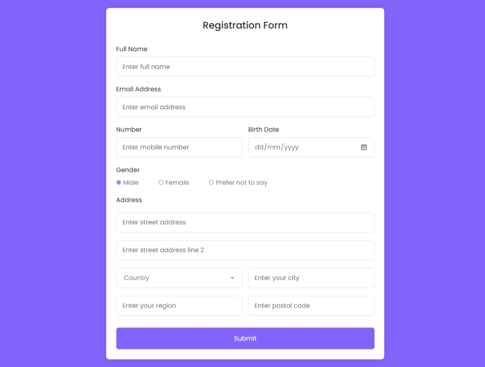

# 📝 Registration Form Project

This is a simple **registration form** built with HTML, CSS (and optionally JavaScript), based on a tutorial I followed on YouTube. I made some personal adjustments to the design and structure to suit my style and practice my frontend skills.

## 🎥 Original Tutorial

This project was inspired by a YouTube tutorial. You can check out the original video here:  
[How to Create Responsive Registration Form in HTML & CSS](https://www.youtube.com/watch?v=moIHTT2XK9g&t=173s&pp=ygUnY29kaW5nIGxhYiByZXNwb25zaXZlIHJlZ2lzdHJhdGlvbiBmb3Jt)

## 🚀 Features

- Clean and responsive design
- Custom styling and layout tweaks
- Organized structure for easy understanding

## 🛠 Technologies Used

- HTML5
- CSS3  

## 📁 File Structure
registration-form/ ├── index.html ├── style.css 


## 🧪 Personal Adjustments

Some changes I made to the original tutorial include:

- Tweaked the colors a little 
- Modified HTML structure

## 📸 Preview



## 📌 How to Use

1. Clone or download this repo:
   ```bash
   git clone https://github.com/JesNetWD/Responsive-Registration-Form
2. Open `index.html` in your browser  
3. Modify and build on it as you like!

## 💡 Future Improvements

- Add backend integration (e.g., PHP or Node.js)
- Add javascript
- Store form data   

## 🙌 Acknowledgements

Thanks to [CodingLab](https://www.youtube.com/channel/UCBlr2jG1onljL-gUy9bbhJw) for the original tutorial that inspired this project.  

